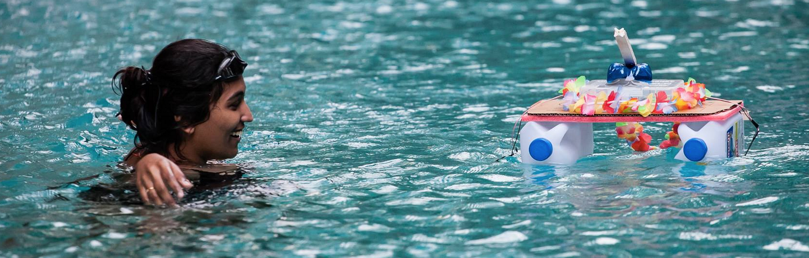

# NodeBoats Workshop

## Workshop Material

- [What to bring along?](instructions.md)
- [Workshop Introduction](presentation.md)
- [Getting Started](getting-started.md)
- [Ideas/Inspiration](ideas.md)
- [Competition Information](competition.md)

### Aim

Let's Make something! Inspired by [NodeBoats at JSConf](http://makezine.com/2014/06/02/turning-coders-into-makers-at-jsconf-2014/)

Let's build boats that can be controlled by web technologies. We will make boats that can communicate over WiFi to a Node app.

The exact design of the boat and the control will be up to the individual team's creativity.

### Teams

- Maximum of 10 teams (that's all we can accommodate in the room)
- Each team has 2 members

### CampJS V 2015

**NodeBoats workshop at [CampJS V](http://v.campjs.com/)**

**Date** : 23-24th May 2015

**Venue** : Beach, Lord Somers Camp, Victoria, Australia

**Time** : 10am - 5pm *Catch the race on Sunday at TBA!*

### Competition

We will have a competition at the end of the day using the boats everyone created. The exact goal of the competition will be announced during the workshop.

The competition will be held at the **Beach at 5pm**

There will be prizes!

### Links

### History

*This workshop was first carried out at [JS Conf Asia 2014](http://2014.jsconf.asia/). Checkout the [Nodeboats Workshop Gallery](https://www.facebook.com/media/set/?set=a.615900415180712.1073741830.224477610989663&type=1).*

#### JS Conf Asia 2014

**Nodeboat Builder workshop at [JSConf.Asia 2014](http://2014.jsconf.asia/)**

**Date** : 20th November 2014

**Venue** : Amara Sanctuary, Sentosa, Singapore

**Time** : 9.15am - 5:30pm *Catch the race at 5:15pm!*
