#Chapter 1 - Spark Core

##Step 1: Setup

####Aim: Turn on and off the `D7` LED on Spark Core from the spark-cli

1. **Create a Spark Core account and claim your spark**

	1. Go to the [Spark Core website](https://www.spark.io/)
	- Click `Launch` to create an account
- Glance through the [documentation](http://docs.spark.io/api/)
	- Blinking [LED colors/actions and their meanings](http://docs.spark.io/start/#step-3-connect-your-core-to-the-cloud)
	- Spark Core [pinout diagram](http://docs.spark.io/assets/images/spark-pinout.png)
- **Connect the Spark Core**
	1.  Go through the steps in the [starting docs](http://docs.spark.io/start/)
	- Plug the micro USB of the Spark Core to your laptop and see the blinking blue light
- **Claim your Spark Core using spark-cli**
	1. [Download and install spark-cli](https://www.npmjs.org/package/spark-cli) `npm install -g spark-cli`
	- [Setup spark-cli on your machine](http://docs.spark.io/cli/#getting-started) with `spark setup`
	- Once your Spark Core is setup, the [LED on top it will start breathing cyan](img/breathing.gif)
	- [Control your SparkCore](http://docs.spark.io/cli/#blink-an-led-with-tinker) from `spark-cli` by turning on and off the LED connected to the "D7" pin

	```shell
	$ spark call {SPARK_CORE_NAME} digitalwrite D7,HIGH
	1
	$ spark call {SPARK_CORE_NAME} digitalwrite D7,LOW
	1
	```

	4. We WILL NOT be using the Spark Mobile Apps to claim and configure the SparkCore to ensure that we don't have issues with which Spark Core you connect to.

##Step 2: Curl

####Aim: Turn on and off the `D7` LED with HTTP via curl commands

1. Now that we can control the Spark Core with code, we need to be able to do it wirelessly. SparkCore has a built-in WiFi module (that we configured earlier) that allows us to talk to it over HTTP. Let's see how that works.
- If you forget your `Device ID` and `Access Token` you can also get it from the Spark Website.
	1. Get your `Device ID` from [here](https://www.spark.io/build/new#cores) and click on `Core`
		
	- Get your `Access Token` from [here](https://www.spark.io/build/new#cores) and click on `Settings`
		
- Connect to your Spark Core from your laptop's command line with a HTTP GET request using the Spark Cloud API. Note the 4 exposed functions "digitalread", "digitalwrite", "analogread" and "analogwrite"
  ```shell
  $ curl -X GET -H "Authorization: Bearer {ACCESS_TOKEN}" https://api.spark.io/v1/devices/{DEVICE_ID}

  {
    "id": "{DEVICE_ID}",
    "name": "{DEVICE_NAME}",
    "connected": true,
    "variables": {},
    "functions": [
      "digitalread",
      "digitalwrite",
      "analogread",
      "analogwrite"
    ]
  }
  ```
- Now, turn on and off the `D7` LED with Spark Cloud API using the HTTP POST request to the `digitalwrite` endpoint

	1. Turn on the LED with params `D7,HIGH`

	  ```shell
	  curl -X POST -H "Authorization: Bearer {ACCESS_TOKEN}" https://api.spark.io/v1/devices/{DEVICE_ID}/digitalwrite -d params=D7,HIGH

	  {
	    "id": "{DEVICE_ID}",
	    "name": "{DEVICE_NAME}",
	    "last_app": null,
	    "connected": true,
	    "return_value": 1
	  }
	  ```
	- Turn off the LED with params `D7,LOW`

	  ```shell
	  curl -X POST -H "Authorization: Bearer {ACCESS_TOKEN}" https://api.spark.io/v1/devices/{DEVICE_ID}/digitalwrite -d params=D7,HIGH

	  {
	    "id": "{DEVICE_ID}",
	    "name": "{DEVICE_NAME}",
	    "last_app": null,
	    "connected": true,
	    "return_value": 1
	  }
	  ```

##Step 3: Setup with Node.js

####Aim: Turn on and off the `D7` LED over TCP.

1. While using Spark Cloud and HTTP is a great way of controlling the Spark Core wirelessly, we need something a with a lot less latency. So we have to ditch HTTP to go with pure TCP.
- [voodoospark](https://github.com/voodootikigod/voodoospark) is a great firmware for the SparkCore which listens to packets over TCP. It implements a RPC style binary protocol which can do basic functions like turning on/off specific pins on the Spark. Just what we need.
- **Load the firmware**
	1. The latest version (> 0.4.5) of the voodoospark firmware is [bundled together with spark-cli as a binary](https://github.com/spark/spark-cli/tree/master/js/binaries).
	- spark-cli[ provides a handy way of flashing voodoospark](https://github.com/spark/spark-cli#flashing-a-known-app) (or reset the Spark Core to the original Tinker firmware) using the command :
	```shell
		$ spark flash {DEVICE_ID} voodoo
	```
	- Wait for the core to start breathing cyan.
	- Run the curl command again and see what functions are exposed now

		```shell
		$ curl -X GET -H "Authorization: Bearer {ACCESS_TOKEN}" https://api.spark.io/v1/devices/{DEVICE_ID}

		{
		  "id": "{DEVICE_ID}",
		  "name": "{DEVICE_NAME}",
		  "connected": true,
		  "variables": {
		    "endpoint": "string"
		  },
		  "functions": [],
		  "cc3000_patch_version": "1.29"
		}
		```
	- Check the local IP address of the Spark Core. `result` will give you the IP.

		```shell
		$ curl -X GET -H "Authorization: Bearer {ACCESS_TOKEN}" https://api.spark.io/v1/devices/{DEVICE_ID}/endpoint

		{
		  "cmd": "VarReturn",
		  "name": "endpoint",
		  "result": "{LOCAL_IP_ADDRESS}",
		  "coreInfo": {
		    "last_app": "",
		    "last_heard": "{CURRENT DATETIME}",
		    "connected": true,
		    "deviceID": "{DEVICE_ID}"
		  }
		}

		```
- **Create blinking LED with Node**
	1. Spark-io is the companion JS library which can speak the same binary RPC protocol over TCP as the voodoospark does. Let's install that!
	- Install Spark-io with `npm install spark-io`
	- [Store the `Device ID` and `Access Token`](https://github.com/rwaldron/spark-io#getting-started) in a `~/.sparkrc` file
	- Create a [blinking LED node script](https://github.com/rwaldron/spark-io#blink-an-led)
	- Create the [blinking LED with Johnny Five plugin](https://github.com/rwaldron/spark-io#johnny-five-io-plugin)
	- Create another node script. When you run this the [node repl](http://nodejs.org/api/repl.html) will appear

		```js
		var five = require("johnny-five");
		var Spark = require("spark-io");

		var board = new five.Board({
		  io: new Spark({
		    token: process.env.SPARK_TOKEN,
		    deviceId: process.env.SPARK_DEVICE_ID
		  })
		});

		board.on("ready", function() {
		  var led = new five.Led("D7");

		  // This bit of js injects the led variable into the
		  // repl you get after this script finishes execution.
		  board.repl.inject({
		    led: led
		  });

		});
		```
		Turn on / off the LED in the repl with these commands:
		- `>> led.on()`
		- `>> led.off()`

		Blink / stop the LED in the repl with these commands:
		- `>> led.blink()`
		- `>> led.stop()`

#Chapter 2 - Motors & Servo

Now that we have the SparkCore under our almost realtime control, lets figure out how we can use it to control motors. Motors are awesome as they make things move!

We will be needing a few common electronics components for this part of the workshop. Let's briefly look at what we may need.

##Step 1: Know the components

<table style="vertical-slign:top;">
	<tr>
		<td width="4%">#</td>
		<td width="32%">Name & Notes</td>
		<td width="32%">Schematic</td>
		<td width="32%">Photo</td>
	</tr>
	<tr>
		<td>1</td>
		<td>
			<strong>Breadboard</strong>
			<ul>
				<li><a href="http://en.wikipedia.org/wiki/Breadboard">Wikipedia</a></li>
				<li>Wiring pattern in a breadboard<br></li>
				<li>
					<strong>Horizontal rows</strong>
					<ul>
						<li>HIGH / Vin (~6V)</li>
						<li>LOW / Gnd (0V)</li>
					</ul>
				</li>
				<li><strong>Tip: </strong> Plug in the +/- of the batteries to the horizontal rows and connect +/- ends from any components on the breadboard to these lines.</li>
			</ul>
		</td>
		<td></td>
		<td></td>
	</tr>
	<tr>
		<td>2</td>
		<td>
			<strong>Spark Core</strong>
			<ul>
				<li><a href="http://docs.spark.io/assets/images/spark-pinout.png">pinout diagram</a></li>
				<li><a href="http://docs.spark.io/start/#step-3-connect-your-core-to-the-cloud">LED colors/actions and their meanings</a></li>
			</ul>
		</td>
		<td></td>
		<td></td>
	</tr>
	<tr>
		<td>3</td>
		<td>
			<strong>Motor Driver chip L293NE</strong>
			<ul>
			 	<li><a href="http://www.ti.com/lit/ds/symlink/l293d.pdf">datasheet</a></li>
			 	<li><strong>Tip:</strong> Note the position of the notch on the schematic and place this chip on the breadboard accordingly. It will help to point out the pin positions for debugging and wiring.</li>
		 	</ul>
		 </td>
		<td></td>
		<td></td>
	</tr>
	<tr>
		<td>4</td>
		<td>
			<strong>Diode</strong>
			<ul>
				<li><a href="http://en.wikipedia.org/wiki/Diode">Wikipedia</a></li>
				<li>diode polarity<br>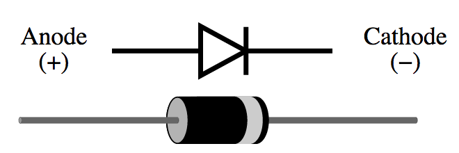</li>
				<li>
					In this case, the diodes are used for inductive transient suppression
					<br>
					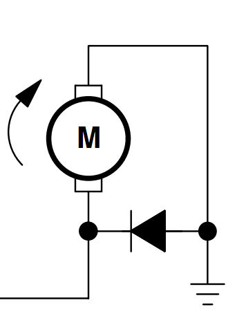
				</li>
				<li><strong>Tip: </strong> Note the white strip (cathode) of the diode while wiring up the breadboard. The anode is connected to the ground.</li>
			</ul>
		</td>
		<td></td>
		<td></td>
	</tr>
	<tr>
		<td>5</td>
		<td>
			<strong>LED</strong> (light emitting diode)
			<ul>
				<li><a href="http://en.wikipedia.org/wiki/Light-emitting_diode">Wikipedia</a></li>
				<li>
					LED polarity
					<ul>
						<li><strong>shorter leg: </strong>cathode - connect to ground</li>
						<li><strong>longer leg: </strong>anode - connect to power</li>
					</ul>
				</li>
				<li><strong>Tip: </strong>Instead of connecting to the motors/servo initially, use these LEDs for easier debugging.</li>
			</ul>
		</td>
		<td></td>
		<td></td>
	</tr>
	<tr>
		<td>6</td>
		<td>
			<strong>jumper cables</strong>
			<ul>
				<li><strong>Tip: </strong>Use the same color wires as the schematic so that it will be faster to trace the wires for debugging. E.g. use <strong>RED</strong> for power and <strong>BLACK</strong> for ground. <strong>YELLOW</strong> and <strong>GREEN</strong> for the motor endpoints.</li>
			</ul>
		</td>
		<td></td>
		<td></td>
	</tr>
	<tr>
		<td>7</td>
		<td>
			<strong>battery pack</strong>
			<ul>
				<li>We will use 4 <a href="http://en.wikipedia.org/wiki/AA_battery">AA batteries</a> of 6V</li>
				<li><strong>Tip: </strong>Connect the +/- ends of the battery pack to the horizontal lines of the breadboard</li>
			</ul>
		</td>
		<td></td>
		<td></td>
	</tr>
	<tr>
		<td>8</td>
		<td>
			<strong>Motors</strong>
			<ul>
				<li><strong>Note: </strong>Motors don't have a Positive/Negative terminal. Depends on how they are attached they can either run forward or backward. </li>
				<li><strong>Tip: </strong>Use an LED to check for high and low before connecting the motors.</li>
			</ul>
		</td>
		<td>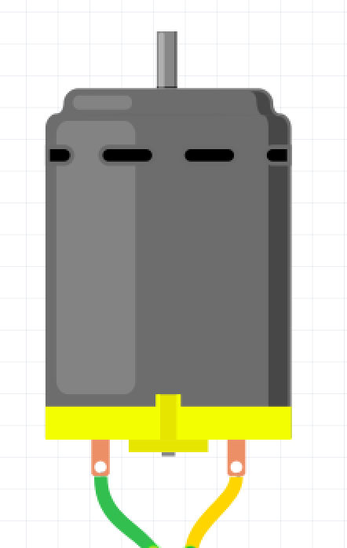</td>
		<td></td>
	</tr>
	<tr>
		<td>9</td>
		<td>
			<strong>Servo</strong>
			<ul>
				<li><a href="http://en.wikipedia.org/wiki/Servo_(radio_control)">Wikipedia</a></li>
				<li><a href="http://docs.spark.io/shields/#setting-up-the-shield-8-micro-servo-1">Spark and servo</a></li>
				<li><strong>Tip: </strong>For wiring - <em>Yellow</em> is Signal (D0, D1, A0, A1, A4, A5, A6, A7), <em>Orange</em> is +5V (VIN), <em>Brown</em> is ground</li>
			</ul>
		</td>
		<td></td>
		<td></td>
	</tr>
	<tr>
		<td>10</td>
		<td>
			<strong>Capacitor</strong>
			<ul>
				<li><a href="http://en.wikipedia.org/wiki/Capacitor">Wikipedia</a></li>
				<li><a href="http://docs.spark.io/shields/#setting-up-the-shield-2-electrolytic-capacitor-100uf-5">Capacitors</a></li>
				<li><strong>Tip: </strong> Capacitors have polarity. On the plastic above one of the pins you'll see a light coloured strip with a negative sign "-" on it. Always connect that pin to GND pins or rails </li>
			</ul>
		</td>
		<td></td>
		<td></td>
	</tr>
</table>

##Step 2: Wire up with an LED, then motor

To control a motor (propeller), we need to use a Motor Driver Integrated Chip (IC). This L293 IC is designed to allow microcontrollers like the Spark Core to control motors, which can draw lots of current.

The L293 Motor Driver is controlled using [Pulse Width Modulation](http://en.wikipedia.org/wiki/Pulse-width_modulation) from the SparkCore. This technique allows us to modulate the power provided to the L293 Motor Driver, and hence control the speed of the motor. Only a few pins on the SparkCore are able to output PWM signals (D0, D1, A0, A1, A4, A5, A6, A7).

For starters, lets wire up a L293 Motor Driver with LEDs instead of motors to check of our circuit works.

1. Follow the schematic below and wire it up accordingly with LEDs instead of
motors.
	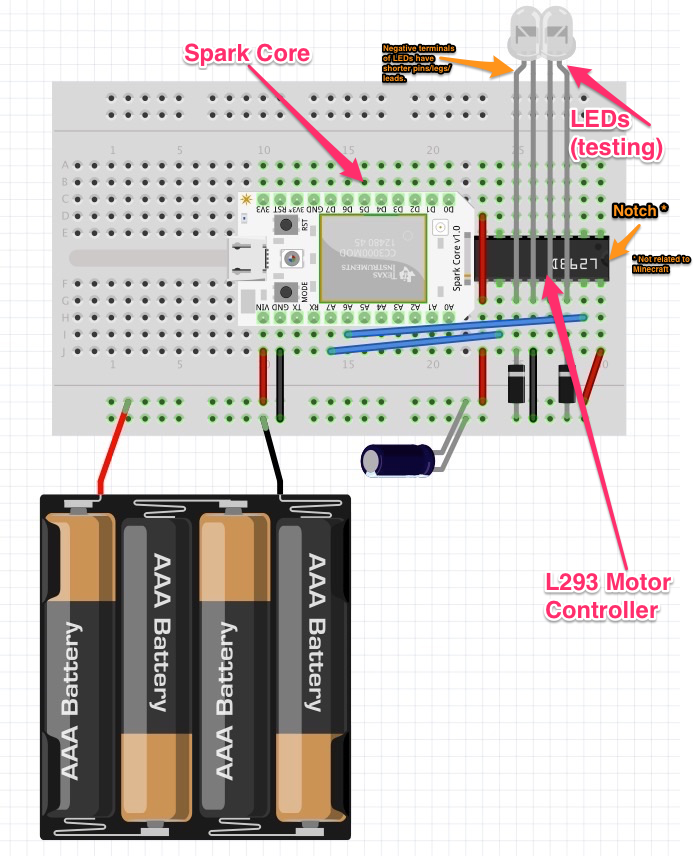

	The original files for these schematic (made in [Fritzing](http://fritzing.org/download/)) are [here](https://github.com/notthetup/nodeboatbuilder/tree/master/schematics).

- The L293 Motor Driver IC pins are number as defined in this diagram

	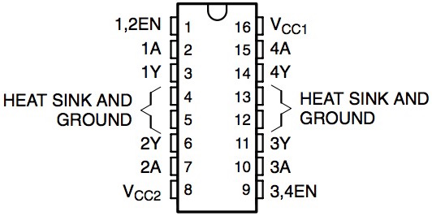

- The connections you will be making are.

	| Signal         | Source                    | Destination  			       |
	|----------------|---------------------------|---------------------------|
	| Power(VCC)     | Battery Pack Red          | Power Rail on Breadboard  |
	| Ground(Gnd)    | Battery Pack Black        | Ground Rail on Breadboard |
	| Power(VCC)     | Vin on SparkCore          | Power Rail on Breadboard  |
	| Power(VCC)     | Pin 16 on L293D           | Power Rail on Breadboard  |
	| Power(VCC)     | Pin 8 on L293D            | Power Rail on Breadboard  |
	| Ground(Gnd)    | Gnd on SparkCore          | Ground Rail on Breadboard |
	| Ground(Gnd)    | Pin 12 on L293D           | Ground Rail on Breadboard |
	| Enable Motor   | Pin 9 on L293D            | Power Rail on Breadboard  |
	| Motor 1 Control| Pin A6 on SparkCore       | Pin 15 on L293D           |
	| Motor 2 Control| Pin A7 on SparkCore       | Pin 10 on L293D           |
	| LED 1 Positive | Pin 11 on L293D           | LED 1 Positive            |
	| LED 1 Negative | Pin 12 on L293D           | LED 1 Negative (shorter)  |
	| LED 2 Positive | Pin 14 on L293D           | LED 2 Positive            |
	| LED 2 Negative | Pin 13 on L293D           | LED 2 Negative (shorter)  |
	| Diode          | Ground Rail on Breadboard | Pin 11 on l293d           |
	| Diode          | Ground Rail on Breadboard | Pin 14 on L293D           |

- Create a file `motor.js` with the following code:

	```js
	var five = require("johnny-five");
	var Spark = require("spark-io");
	var board = new five.Board({
	  io: new Spark({
	    token: process.env.SPARK_TOKEN,
	    deviceId: process.env.SPARK_DEVICE_ID
	  })
	});

	board.on("ready", function() {
	  motorL = new five.Motor({
	    pin: 'A7'
	  });

	  motorR = new five.Motor({
	    pin: 'A6'
	  });

	  board.repl.inject({
	    l: motorL,
	    r: motorR
	  });

	});
	```
	Run this code with `node motor.js` - can you hear the motors running?

	```js
	>> r.start(50) // right LED should light up dim
	>> r.start(100) // right LED should light up bright
	>> r.stop() // right LED should not light up

	>> l.start(50) // left LED should light up dim
	>> l.start(100) // left LED should light up bright
	>> l.stop() // left LED should not light up
	```

## Hacking the Propeller

The Tamiya propeller is designed to be used with battries. We'll hack it to work with our motor controller. We have already drilled the propeller, you'll need to assemble the motor, the seal and the blade. Here are some steps. _There also are instructions on the paper that comes with the kit_

1. The Propeller Kit

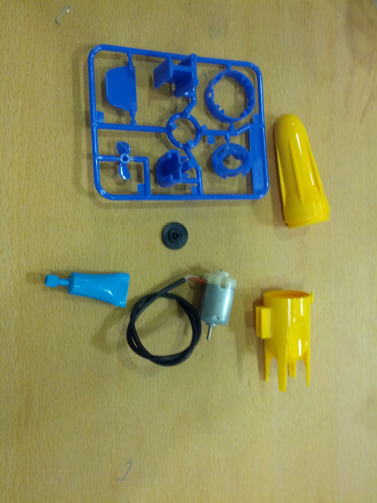

- Add the Blue Plastic bracket on the motor. _Click!_

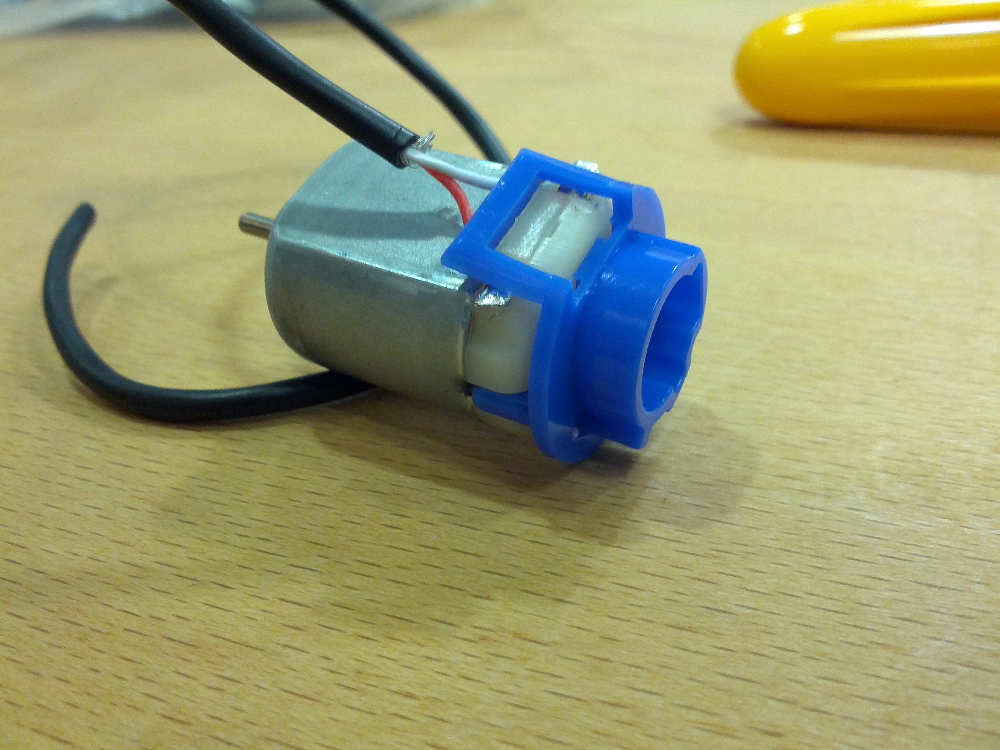

- Add **grease** to the motor shaft

- Add **the black rubber seal** onto the shaft

- Fold the cable over

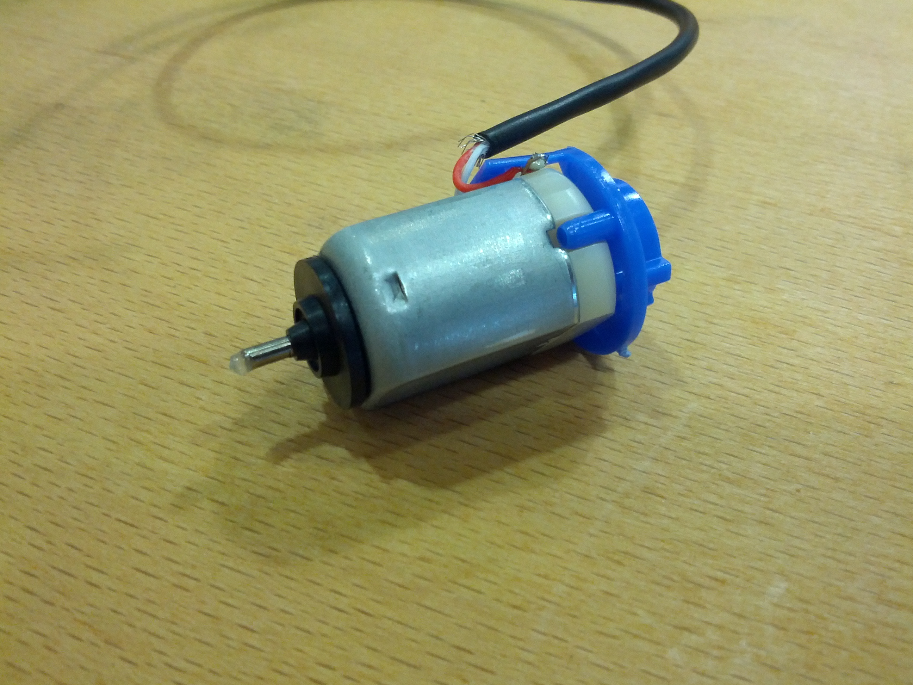

- Insert motor in the propeller

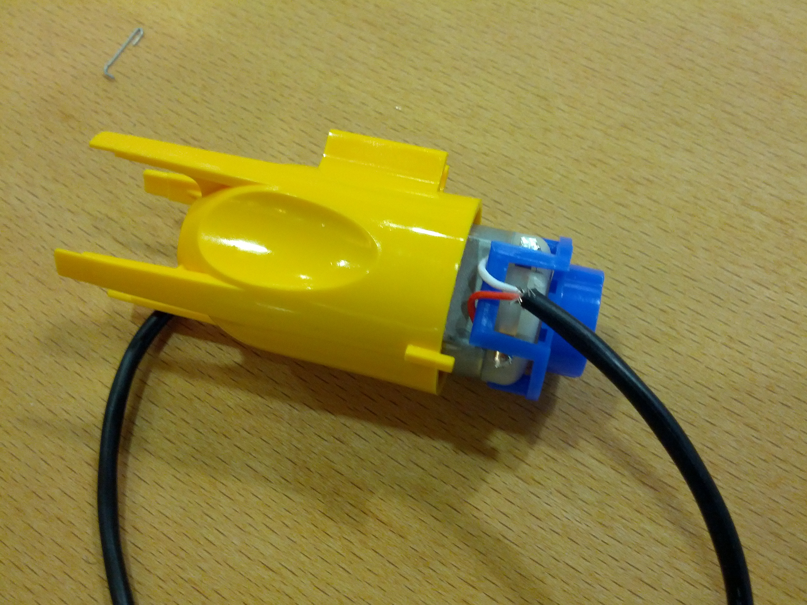

- Add the propeller blades

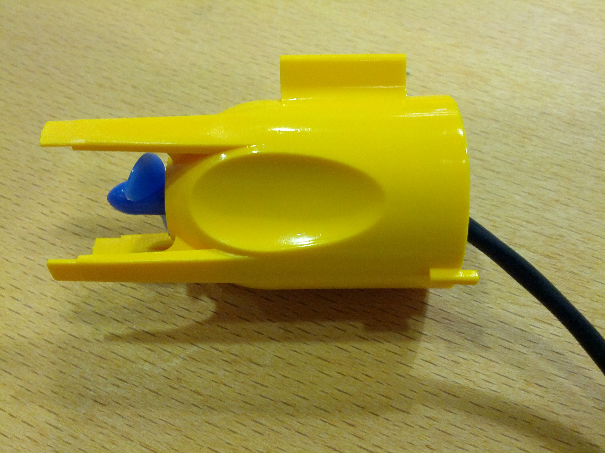

- Thread the wire through the hole in the front half of propeller

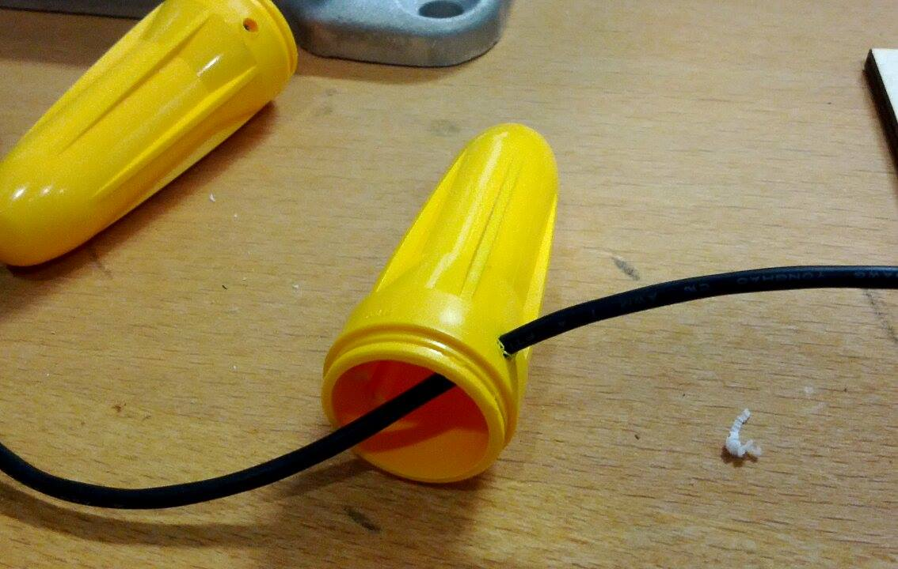

- Attach the two halves of the propeller

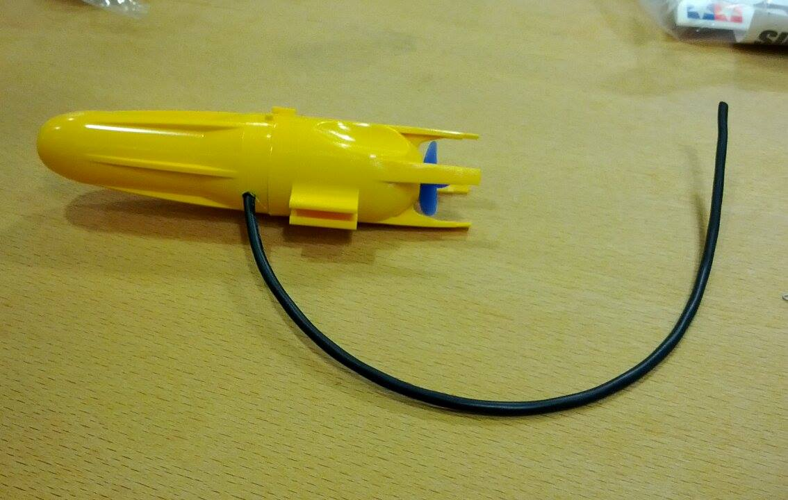

- Fill the wire hole with some silicone sealent.

## Add the Propeller!

1.  Now, replace the LEDs with motors (Tamiya Propellers)! And run the same above code. _VVvvvrrroooommmm vvrrrroooommm ;-)_

	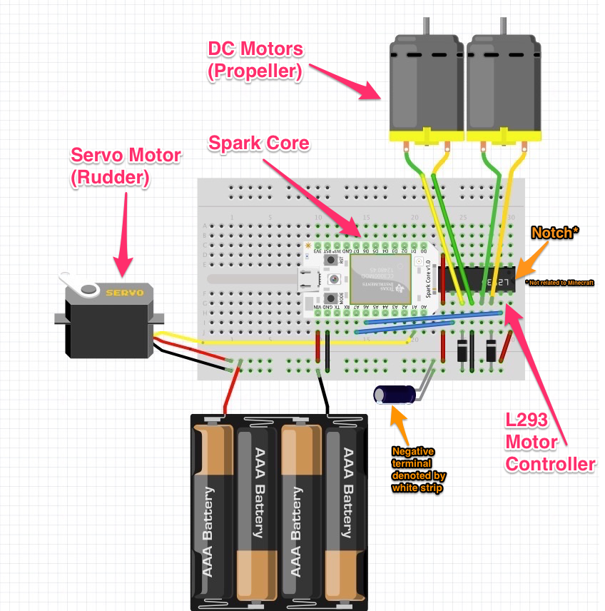

	The original files for these schematic (made in [Fritzing](http://fritzing.org/download/)) are [here](https://github.com/notthetup/nodeboatbuilder/tree/master/schematics).

- Here are the connections for the updated schematic.

	| Signal           | Source                    | Destination  			       |
	|------------------|---------------------------|---------------------------|
	| Power(VCC)       | Battery Pack Red          | Power Rail on Breadboard  |
	| Ground(Gnd)      | Battery Pack Black        | Ground Rail on Breadboard |
	| Power(VCC)       | Vin on SparkCore          | Power Rail on Breadboard  |
	| Power(VCC)       | Pin 16 on L293D           | Power Rail on Breadboard  |
	| Power(VCC)       | Pin 8 on L293D            | Power Rail on Breadboard  |
	| Ground(Gnd)      | Gnd on SparkCore          | Ground Rail on Breadboard |
	| Ground(Gnd)      | Pin 12 on L293D           | Ground Rail on Breadboard |
	| Enable Motor     | Pin 9 on L293D            | Power Rail on Breadboard  |
	| Motor 1 Control  | Pin A6 on SparkCore       | Pin 15 on L293D           |
	| Motor 2 Control  | Pin A7 on SparkCore       | Pin 10 on L293D           |
	| _Motor 1 Pin 1_  | Pin 11 on L293D           | LED 1 Positive            |
	| _Motor 1 Pin 2_  | Pin 12 on L293D           | LED 1 Negative (shorter)  |
	| _Motor 2 Pin 1_  | Pin 14 on L293D           | LED 2 Positive            |
	| _Motor 1 Pin 2_  | Pin 13 on L293D           | LED 2 Negative (shorter)  |
	| Diode            | Ground Rail on Breadboard | Pin 11 on l293d           |
	| Diode            | Ground Rail on Breadboard | Pin 14 on L293D           |

- This method of connecting the motor allows us to either turn the motor on or off. You can't control the direction of the motor. If you accidently wired the motor such that it runs backwards then just swap the two pins that connect to the motor.

##Step 3: Add on the servo

A normal motor (DC Motor) that our propellers have allows us to move forward (and maybe backwards), but to change directions, we might need to use a Servo motor. Servos are precision motors that you can turn exact number of degrees from the center.

Servos are great for turning things accurately. In our scenario, we could turn propellers, rudders, fans, etc.

1. Follow the schematic below and add on the servo.

	

- Here are the connections for connecting the servo.

	|Signal           | Source                    | Destination  			       |
	|------------------|---------------------------|---------------------------|
	| Power(VCC)       | Battery Pack Red          | Power Rail on Breadboard  |
	| Ground(Gnd)      | Battery Pack Black        | Ground Rail on Breadboard |
	| Power(VCC)       | Orange on Servo           | Power Rail on Breadboard  |
	| Ground(VCC)      | Brown on Servo            | Ground Rail on Breadboard |
	| Servo Control    | Yellow on Servo           | Pin A1 on SparkCore |


	The original files for these schematic (made in [Fritzing](http://fritzing.org/download/)) are [here](https://github.com/notthetup/nodeboatbuilder/tree/master/schematics).
- Create a file `servo.js` with the following code:

	```js
	var five = require("johnny-five");
	var Spark = require("spark-io");

	var board = new five.Board({
	  io: new Spark({
	    token: process.env.SPARK_TOKEN,
	    deviceId: process.env.SPARK_DEVICE_ID
	  })
	});

	board.on("ready", function() {
	  var servo = new five.Servo("A1");

	  board.repl.inject({
	    s: servo
	  });

	});
	```

	Run this code with `node servo.js` - yes the servo should move!

	```js
	>> s.min() // set the servo to the minimum degrees, default to 0
	>> s.max() // set the servo to the maximum degrees, default to 180
	>> s.to(90) // move the servo to move the servo to degree 90
	```
- play with other [servo functions from Johnny Five](https://github.com/rwaldron/johnny-five/blob/master/docs/servo.md)
- Onwards to making the boat now. _Yiiiihooooo ;-)_

#Chapter 3 - Lets make Boat!

Now that we know how to control physical functionality, let's get creative and make a boat. Our boats needs to stay afloat, and it needs to move based on our control.


## Buoyancy

1. Buoyancy is critical in making boats. You don't want your boat to sink!
- Ensure that no water EVER! comes in contact with the electronics. Water and electronics don't mix.
- If your boat is heavy and has large portions of it under water, then you're adding drag to the boat. This is going to slow your boat down.
- You can always make your boat more boyant by attaching some styrofoam or plastic bottles to it.
- Ensure that there are no leaks in the boat, always pot all holes you drill with the silicone sealent. _No one ever liked leaky abstractions or boats._
- Keep in mind where you put your weights (motors, battries, SparkCore, etc). A level boat is more controllable than a boat which is tilted. _Just like with fonts_


## Propulsion

1. A single motor (propeller) can only propel you forward. If you want to be able to turn, you will need more control.
- Rudders are commonly used in combination propellers to change directions of a boat.

	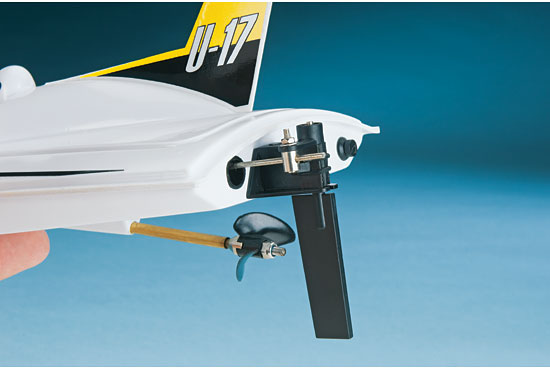

- Rudders can made using servos and some acrylic.
- Here are some common propultion mechanism ideas.

	- 1 Propeller + 1 Servo controlling a Rudder (in the center)
	- 2 Propellers + 2 Servos controlling a Rudder (one on each side)
	- 1 Propeller attached to a Servo (in the center)
	- 2 Propellers attached to a Servo each (one on each side)
	- 2 Propellers using differential propultion


## Ideas

There are no correct answers to how you can design your boat, and it's propultion. Be creative, try stuff out, scour the interwebs for ideas, and come up with something novel. Use any materials avilable (_you may beg, borrrow and 'steal' stuff you need_) to use make our boat float and make it move forward!

- Here are some pictures and ideas to start you off.

	- [RC bottle boat](http://www.stormthecastle.com/Things/bottle-boat/bottle-boat-2.htm)
	- [servo boat rudder](https://www.google.com.sg/search?espv=2&biw=1278&bih=678&tbm=isch&sa=1&q=servo+boat+rudder&oq=servo+boat+rudder&gs_l=img.3...8945.11531.0.11708.11.8.0.3.3.0.51.353.8.8.0....0...1c.1.58.img..5.6.144.jebZ-Zn56pE#facrc=_&imgdii=3aZLAU1QvrNkRM%3A%3BBJ7gdxvEA7P9nM%3B3aZLAU1QvrNkRM%3A&imgrc=3aZLAU1QvrNkRM%253A%3BwA_jMX73K_13NM%3Bhttp%253A%252F%252Fwww.towerhobbies.com%252Fproducts%252Faquacraft%252Faqub16%252Faqub16_rudder_550.jpg%3Bhttp%253A%252F%252Fwww.towerhobbies.com%252Fproducts%252Faquacraft%252Faqub16.html%3B550%3B370)
	- [boat propeller rudder](https://www.google.com.sg/search?espv=2&biw=1278&bih=678&tbm=isch&sa=1&q=rc+boat+propeller+rudder&oq=rc+boat+propeller+rudder&gs_l=img.3...1903.2323.0.3940.3.3.0.0.0.0.45.132.3.3.0....0...1c.1.58.img..3.0.0.h7ekTWspEnw)


