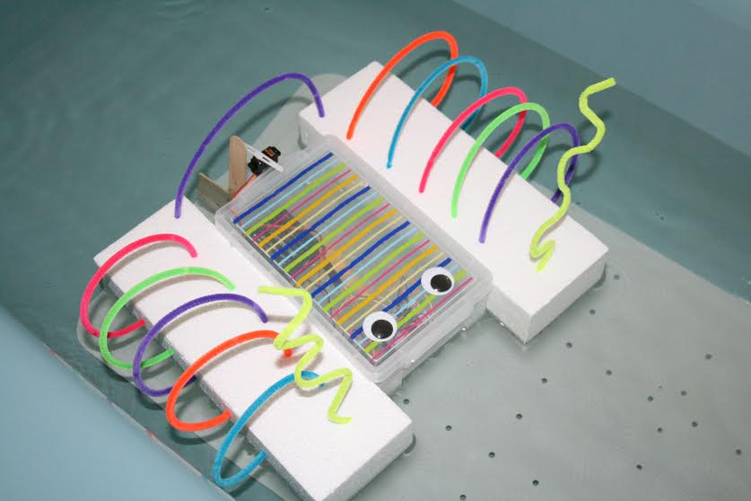
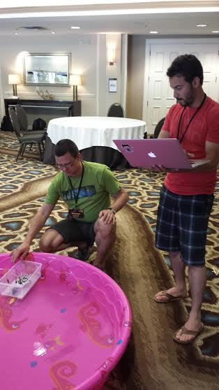
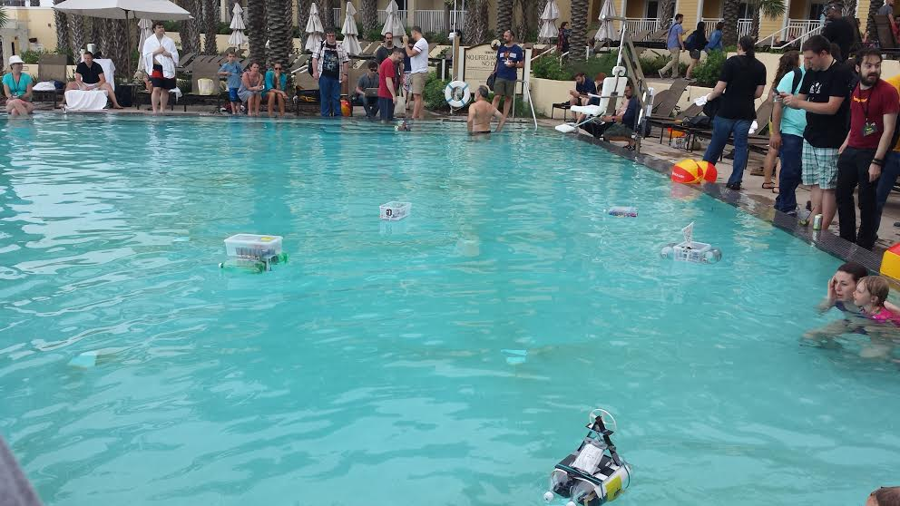
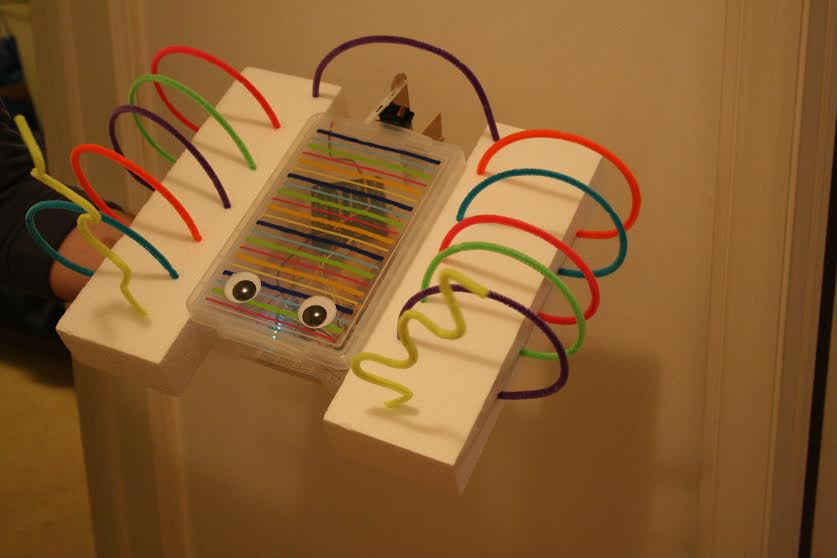
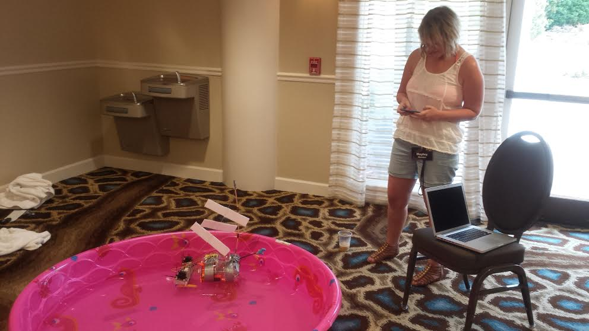
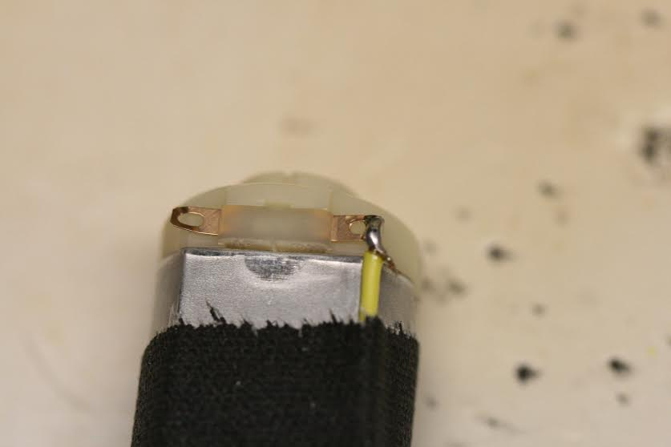
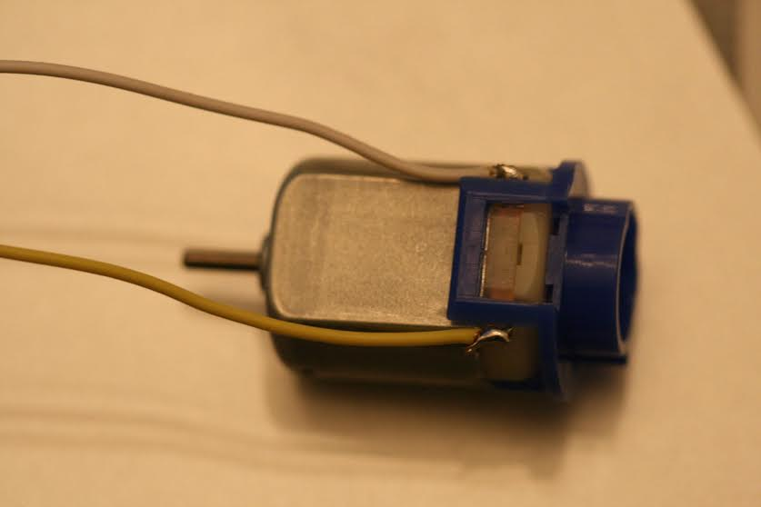
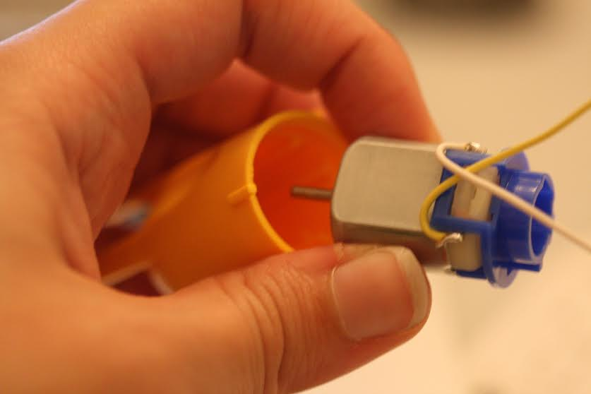
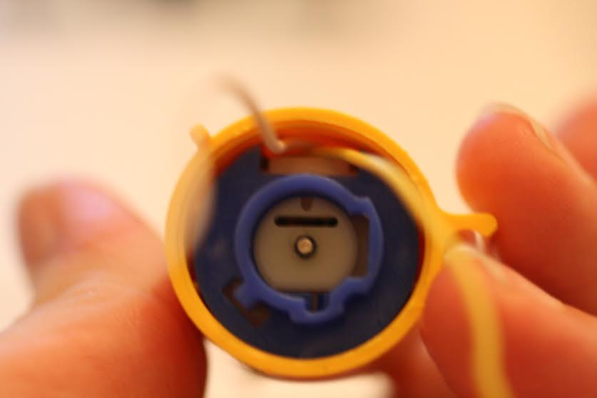

# NodeBoats at JSConf US

[Turning Coders into Makers](http://makezine.com/2014/06/02/turning-coders-into-makers-at-jsconf-2014/)

## Videos from JSCon US

[NodeBoats at JSConf 2014](https://www.youtube.com/watch?v=247MTokODOA)

[NodeBoats at JSConf2014](https://www.youtube.com/watch?v=eKqwo-jvRYo)

[Little ship nodeboat](https://www.youtube.com/watch?v=Kn9UaVDxHW8)

[Big nodeboat destroyer pirate ship](https://www.youtube.com/watch?v=zC0doS9-XZk)

[Look Ma! No Hands!](http://instagram.com/p/vXDkZywojq/)

# Boat Design Ideas

# Hacking the Tamiya Submarine Motor

