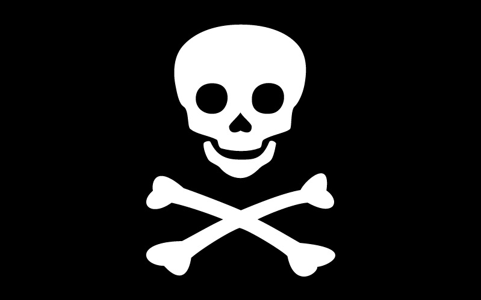

# Instructions for NodeBoatBuilder Attendees

All hands hoay! Welcome t' t' NodeBoats Builder workshop. We'll be makin' some sea farin' vessels today! Let's find out whose vessle will find the booty and whose will scuttle! Hahaha! And when we're all done, head out to the sea for some grog.

## To Bring

1. Laptop + Charger (With Nodejs pre-installed)
2. Shorts/Swim wear (you might need to jump into the pool to fetch your boat)
3. Decorations for your boat. Pirates, canons, stickers, sails, go crazy!
4. An idea for the chasis of your boat. We will provide you some material (plastic boxes, bits and pieces of wood and plastic), but you can bring in more things that you want to use for your boat.

## Teams

We'll be working in teams of two. If you couldn't find a Player2 at registration, then we can pair you up at the begining of the workshop.

## Timing

The workshop starts at 9.15am and runs along side JSConf. We should have enough time to make and test the boats before the competition (at 5.15pm) and still have time time to catch a couple of talks. Feel free to pop in and out to catch a talk or two. If not, all the talks will be on YouTube in a few weeks!

## Workshop material

The workshop material is already avilable [in this Github repo](https://github.com/notthetup/nodeboatbuilder)

# See you at the workshop!

Raise the Jolly Roger and let's begin!

