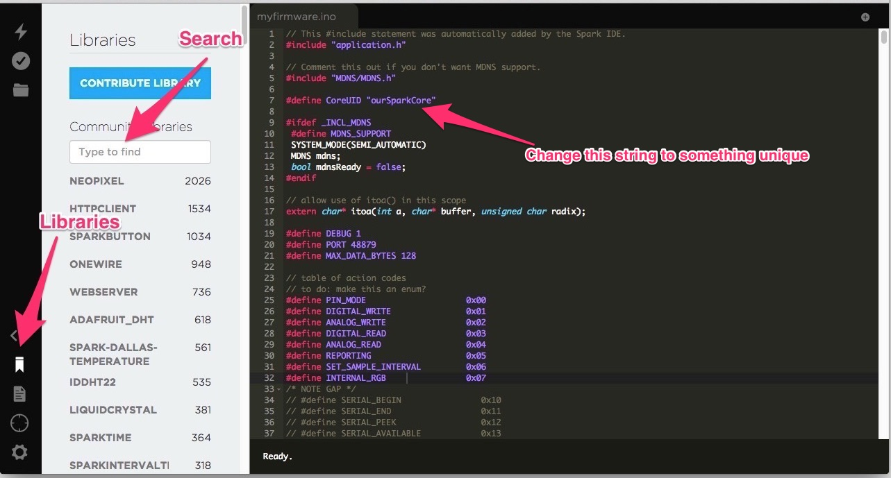
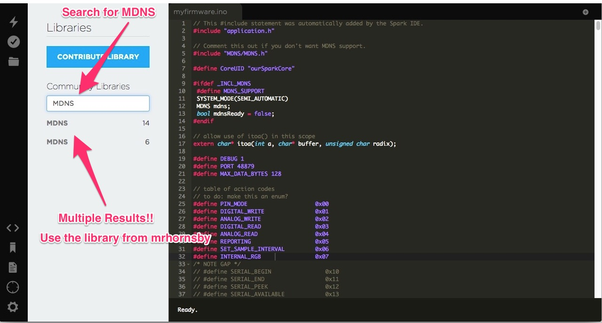
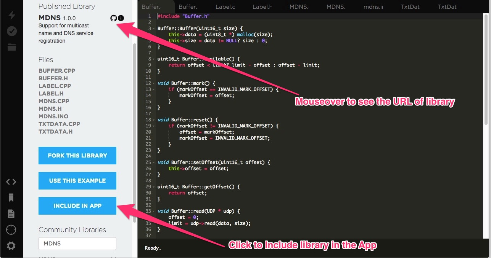

# NodeBoats without Internet access

The current NodeBoats design uses [Spark Cloud](http://docs.particle.io/core/api/) to know the IP Address of the Spark Core. This IP Address is then used to communicate with the Spark Core.

So while, technically all the control communication happens locally, the initial step needs internet access.

In case of situations where internet access is flaky or inexistant, [MDNS](http://en.wikipedia.org/wiki/Multicast_DNS) can be used to exchange the IP Address based on a __HostName__.

## Setting up the SparkCore for MDNS

### Notes

- Unfortunately, the SparkCore tends to be flaky without a good connection to the SparkCloud, and can end trying to connect and not accepting any TCP messages.

- However, the Spark Core has a __SEMI_AUTOMATIC__ mode which allows it to run without a connection to Spark Cloud.

- Running the Spark Core in the __SEMI_AUTOMATIC__ will means none of the Spark APIs are accessible on the Spark Core or vice-versa.

- Hence, using the MDNS version of the SparkCore firmware, you won't be able to use the original version of `spark-io` or Spark APIs.

- You will have to __turn off your firewall__ to allow MDNS to work.

### Steps

1. Open the [Particle Build IDE](https://build.particle.io/build/#code).
2. Create a new App.
3. Copy and paste the firmware code from the [MDNS version of VoodooSpark](https://github.com/notthetup/voodoospark/blob/master/firmware/voodoospark.cpp) into the Build IDE.
4. Change the `CoreUID` to a unqiue string.
	```
	#define CoreUID "myPirateShip"
	```
5. Open the [Libraries Tab](https://build.particle.io/build/#libraries) in the Build IDE.
	
6. Search for the [MDNS library](https://github.com/mrhornsby/spark-core-mdns).
	
7. Add the MDNS library to your new App.
	
8. Flash the new Firmware onto your SparkCore.

## Setting up the Spark-io for MDNS

- This [fork of Spark-io](https://github.com/notthetup/spark-io) supports MDNS.
- You might have to remove the original version of `spark-io`.
- You can install this using npm and the git url

	```shell
	npm i notthetup/spark-io
	```
- The MDNS version of `spark-io` works exactly the same, but tries to look for MDNS messages if a parameter called `hostname` is passed to the option Object in the constructor of `Spark`.

	```js
	var board = new five.Board({
	io: new Spark({
		hostname:'myPirateShip',
		deviceId:'{DEVICE_ID}',
		token:'{ACCESS_TOKEN}'
	})
});
	```

## Restoring Spark Core to original firmware.

### Notes

- Since the MDNS version of the firmware doesn't connect to Spark Cloud, re-flashing from the [Build IDE](https://build.particle.io/build/) will not work.
- To re-flash any other firmware, it easier to [first flash Tinker](https://github.com/spark/particle-cli#flashing-a-known-app) using dfu mode and then flash a new Firmware from the [Build IDE](https://build.particle.io/build/).

### Steps

1. Connect the Spark Core to USB.
2. Put the Spark Core in [dfu mode](http://docs.particle.io/core/modes/#core-modes-dfu-mode-device-firmware-upgrade).
3. Flash in Tinker using the `particle-cli` command

	```shell
	particle flash --usb tinker
	```
4. Wait for the Spark Core to be breathing cyan again before using it normally.
